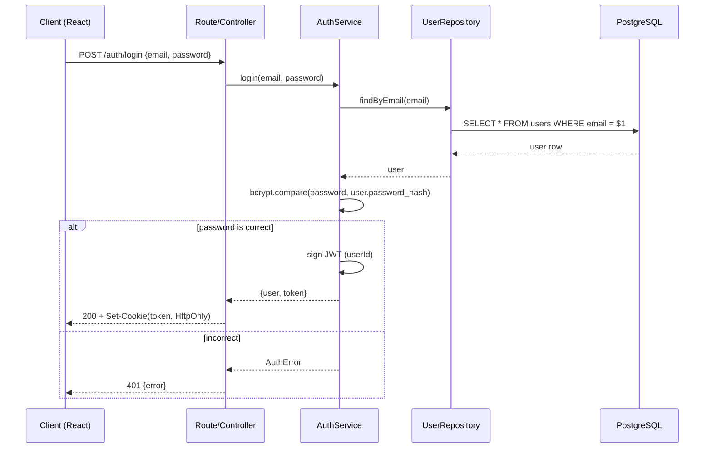
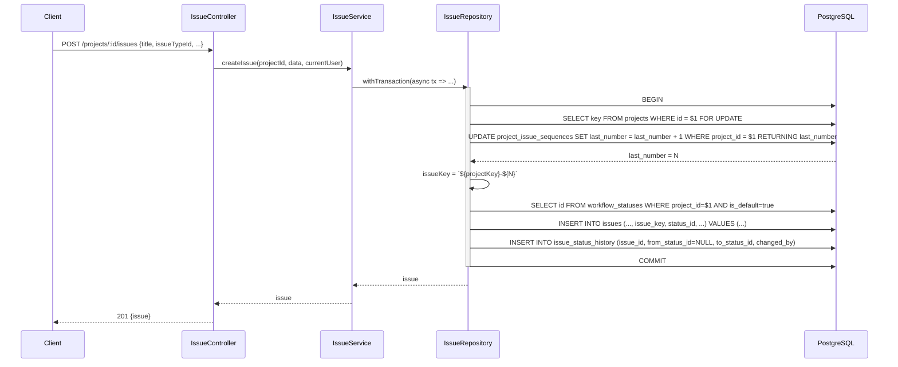
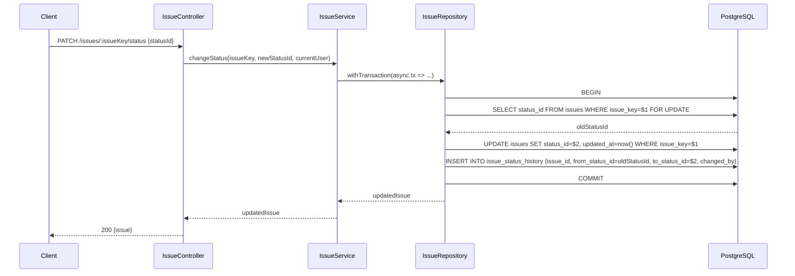
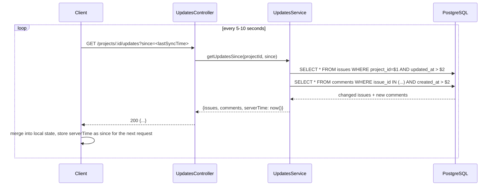

# System Design — Supplement: DB Schema / API Spec / Sequence Diagram / Folder Architecture

> Supplement to `System Design Addendum — Deployment on Windows PC with Docker + PostgreSQL`.
> Decisions applied in this document:
> - `issue_type` and `workflow_status` are **customizable per project** (not fixed globally across the system).
> - The backend follows a **layered architecture**: `routes → controllers → services → repositories`.

---

## 1. Database Schema (Full PostgreSQL DDL)

```sql
-- ========== users ==========
CREATE TABLE users (
    id            INTEGER GENERATED ALWAYS AS IDENTITY PRIMARY KEY,
    name          VARCHAR(120)  NOT NULL,
    email         VARCHAR(255)  NOT NULL UNIQUE,
    password_hash VARCHAR(255)  NOT NULL,
    created_at    TIMESTAMPTZ   NOT NULL DEFAULT now()
);

-- ========== projects ==========
CREATE TABLE projects (
    id          INTEGER GENERATED ALWAYS AS IDENTITY PRIMARY KEY,
    key         VARCHAR(10)   NOT NULL UNIQUE,      -- e.g. "PROJ" -> issue_key "PROJ-123"
    name        VARCHAR(200)  NOT NULL,
    description TEXT,
    created_by  INTEGER       NOT NULL REFERENCES users(id),
    created_at  TIMESTAMPTZ   NOT NULL DEFAULT now()
);

-- ========== project_members ==========
CREATE TABLE project_members (
    project_id   INTEGER      NOT NULL REFERENCES projects(id) ON DELETE CASCADE,
    user_id      INTEGER      NOT NULL REFERENCES users(id)    ON DELETE CASCADE,
    project_role VARCHAR(20)  NOT NULL CHECK (project_role IN ('admin', 'member', 'viewer')),
    joined_at    TIMESTAMPTZ  NOT NULL DEFAULT now(),
    PRIMARY KEY (project_id, user_id)
);

-- ========== project_issue_sequences ==========
-- A separate counter table for each project to generate issue_key values such as "PROJ-123" atomically.
CREATE TABLE project_issue_sequences (
    project_id  INTEGER  PRIMARY KEY REFERENCES projects(id) ON DELETE CASCADE,
    last_number INTEGER  NOT NULL DEFAULT 0
);

-- ========== issue_types (customizable per project) ==========
CREATE TABLE issue_types (
    id         INTEGER GENERATED ALWAYS AS IDENTITY PRIMARY KEY,
    project_id INTEGER      NOT NULL REFERENCES projects(id) ON DELETE CASCADE,
    name       VARCHAR(50)  NOT NULL,          -- e.g. "Bug", "Task", "Story"
    color      VARCHAR(20),                    -- optional display color code
    UNIQUE (project_id, name)
);

-- ========== workflow_statuses (customizable per project) ==========
CREATE TABLE workflow_statuses (
    id         INTEGER GENERATED ALWAYS AS IDENTITY PRIMARY KEY,
    project_id INTEGER      NOT NULL REFERENCES projects(id) ON DELETE CASCADE,
    name       VARCHAR(50)  NOT NULL,          -- e.g. "To Do", "In Progress", "Done"
    position   INTEGER      NOT NULL,          -- display order on the board (0,1,2,...)
    is_default BOOLEAN      NOT NULL DEFAULT false,  -- default status assigned when creating a new issue
    is_final   BOOLEAN      NOT NULL DEFAULT false,  -- status considered "completed" (e.g. Done)
    UNIQUE (project_id, name)
);

-- ========== issues ==========
CREATE TABLE issues (
    id            INTEGER GENERATED ALWAYS AS IDENTITY PRIMARY KEY,
    project_id    INTEGER      NOT NULL REFERENCES projects(id)       ON DELETE CASCADE,
    issue_key     VARCHAR(20)  NOT NULL UNIQUE,      -- e.g. "PROJ-123"
    title         VARCHAR(255) NOT NULL,
    description   TEXT,
    issue_type_id INTEGER      NOT NULL REFERENCES issue_types(id),
    status_id     INTEGER      NOT NULL REFERENCES workflow_statuses(id),
    reporter_id   INTEGER      NOT NULL REFERENCES users(id),
    assignee_id   INTEGER      REFERENCES users(id),
    priority      VARCHAR(10)  NOT NULL DEFAULT 'medium'
                  CHECK (priority IN ('lowest', 'low', 'medium', 'high', 'highest')),
    metadata      JSONB        NOT NULL DEFAULT '{}'::jsonb,  -- flexible custom fields, if needed
    created_at    TIMESTAMPTZ  NOT NULL DEFAULT now(),
    completed_at  TIMESTAMPTZ,
    updated_at    TIMESTAMPTZ  NOT NULL DEFAULT now()
);

-- ========== issue_status_history ==========
CREATE TABLE issue_status_history (
    id             INTEGER GENERATED ALWAYS AS IDENTITY PRIMARY KEY,
    issue_id       INTEGER      NOT NULL REFERENCES issues(id) ON DELETE CASCADE,
    from_status_id INTEGER      REFERENCES workflow_statuses(id),  -- NULL when the issue is first created
    to_status_id   INTEGER      NOT NULL REFERENCES workflow_statuses(id),
    changed_by     INTEGER      NOT NULL REFERENCES users(id),
    changed_at     TIMESTAMPTZ  NOT NULL DEFAULT now()
);

-- ========== comments ==========
CREATE TABLE comments (
    id         INTEGER GENERATED ALWAYS AS IDENTITY PRIMARY KEY,
    issue_id   INTEGER      NOT NULL REFERENCES issues(id) ON DELETE CASCADE,
    user_id    INTEGER      NOT NULL REFERENCES users(id),
    content    TEXT         NOT NULL,
    created_at TIMESTAMPTZ  NOT NULL DEFAULT now(),
    updated_at TIMESTAMPTZ
);

-- ========== issue_attachments ==========
CREATE TABLE issue_attachments (
    id            INTEGER GENERATED ALWAYS AS IDENTITY PRIMARY KEY,
    issue_id      INTEGER      NOT NULL REFERENCES issues(id) ON DELETE CASCADE,
    uploaded_by   INTEGER      NOT NULL REFERENCES users(id),
    file_name     VARCHAR(255) NOT NULL,
    media_type    VARCHAR(120) NOT NULL,
    file_size     INTEGER      CHECK (file_size BETWEEN 1 AND 10485760),
    file_data     BYTEA,
    external_url  VARCHAR(2048),
    provider      VARCHAR(80),
    created_at    TIMESTAMPTZ  NOT NULL DEFAULT now(),
    CONSTRAINT issue_attachments_exactly_one_source CHECK (
      (external_url IS NOT NULL AND file_data IS NULL AND file_size IS NULL)
      OR (external_url IS NULL AND file_data IS NOT NULL AND file_size IS NOT NULL)
    )
);

-- ========== Indexes for common queries ==========
CREATE INDEX idx_issues_project_id   ON issues(project_id);
CREATE INDEX idx_issues_status_id    ON issues(status_id);
CREATE INDEX idx_issues_assignee_id  ON issues(assignee_id);
CREATE INDEX idx_issues_updated_at   ON issues(project_id, updated_at);  -- supports polling for "changes since time X"
CREATE INDEX idx_comments_issue_id   ON comments(issue_id);
CREATE INDEX idx_issue_attachments_issue_created ON issue_attachments(issue_id, created_at DESC);
CREATE INDEX idx_status_history_issue_id ON issue_status_history(issue_id);
CREATE INDEX idx_issue_types_project     ON issue_types(project_id);
CREATE INDEX idx_workflow_statuses_project ON workflow_statuses(project_id);
```

**Important notes:**
- `issue_key` is generated by combining `projects.key` with the number from `project_issue_sequences.last_number`, incremented atomically within a transaction (see Section 3.2 — Sequence Diagram).
- Because `issue_type`/`workflow_status` now belong to individual projects, creating a new project **must seed a default set** (e.g. issue types "Task/Bug/Story", statuses "To Do/In Progress/Done" with the corresponding `is_default`/`is_final` values) — see the `POST /api/projects` API in Section 2.
- `idx_issues_updated_at` exists specifically to support polling (the client asks "what has changed since time T" — see Section 3.4).

---

## 2. API Spec

General conventions:
- Base path: `/api`
- Auth: JWT stored in an HttpOnly Cookie (cookie name `token`); `requireAuth` middleware applies to every route except `auth/register` and `auth/login`.
- Authorization by `project_role` (`admin` / `member` / `viewer`) is enforced through `requireRole([...])` middleware and resolved using the `project_id`/`issue_key` present in the route.
- Standard error response format: `{ "error": { "code": "...", "message": "..." } }`.

### 2.1 Auth

| Method | Path | Auth | Description |
|---|---|---|---|
| POST | `/auth/register` | No | Create a new user. Body: `{ name, email, password }` |
| POST | `/auth/login` | No | Body: `{ email, password }`. Returns JWT via Set-Cookie (HttpOnly); response body returns `{ user }` |
| POST | `/auth/logout` | Yes | Clear the cookie |
| GET  | `/auth/me` | Yes | Return the current user information from the token |

### 2.2 Projects

| Method | Path | Minimum Role | Description |
|---|---|---|---|
| GET | `/projects` | Authenticated | Admin: list every Space; non-admin: list only assigned Spaces |
| POST | `/projects` | Application Admin | Create a Space; creator becomes `admin`, selected `viewerIds` become viewers, and defaults are seeded atomically |
| GET | `/projects/:projectId` | viewer | Project details |
| PATCH | `/projects/:projectId` | admin | Update `name`/`description` |
| DELETE | `/projects/:projectId` | admin | Delete project (cascade all related data) |

The Admin-only Space Settings screen contains a Space details editor. It sends the
trimmed name and nullable description through the existing `PATCH` endpoint; the
Space key is displayed read-only and cannot be changed. After success, client state
must update the active Space header and every matching sidebar entry immediately,
while subsequent home/list/detail reads return the persisted values. This feature
does not add a table, column, endpoint, or dependency.

### 2.3 Project Members

| Method | Path | Minimum Role | Description |
|---|---|---|---|
| GET | `/projects/:projectId/members` | member | List members and roles |
| POST | `/projects/:projectId/members` | admin | Add a member. Body: `{ userId, projectRole }` |
| PATCH | `/projects/:projectId/members/:userId` | admin | Change `projectRole` |
| DELETE | `/projects/:projectId/members/:userId` | admin | Remove a member |

### 2.4 Issue Types (customizable per project)

| Method | Path | Minimum Role | Description |
|---|---|---|---|
| GET | `/projects/:projectId/issue-types` | viewer | List project issue types |
| POST | `/projects/:projectId/issue-types` | admin | Body: `{ name, color? }` |
| PATCH | `/projects/:projectId/issue-types/:id` | admin | Update `name`/`color` |
| DELETE | `/projects/:projectId/issue-types/:id` | admin | Delete (blocked if any issue currently uses this type — return 409) |

### 2.5 Workflow Statuses (customizable per project)

| Method | Path | Minimum Role | Description |
|---|---|---|---|
| GET | `/projects/:projectId/workflow-statuses` | viewer | List statuses ordered by `position` |
| POST | `/projects/:projectId/workflow-statuses` | admin | Body: `{ name, position, isDefault?, isFinal? }` |
| PATCH | `/projects/:projectId/workflow-statuses/:id` | admin | Update properties |
| PATCH | `/projects/:projectId/workflow-statuses/reorder` | admin | Body: `{ orderedIds: [id1, id2, ...] }` — update `position` values in bulk |
| DELETE | `/projects/:projectId/workflow-statuses/:id` | admin | Block deletion if any issue is currently in this status (409) |

### 2.6 Issues

| Method | Path | Minimum Role | Description |
|---|---|---|---|
| GET | `/projects/:projectId/issues` | viewer | Query params: `status_id`, `assignee_id`, `issue_type_id`, `created_on`, `completed_on`, `page`, `pageSize` |
| POST | `/projects/:projectId/issues` | member | Body: `{ title, description?, issueTypeId, assigneeId?, priority? }`. Service generates `issue_key` atomically (Section 3.2) and assigns `status_id` to the project's status where `is_default = true` |
| GET | `/issues/:issueKey` | viewer | Issue details |
| PATCH | `/issues/:issueKey` | member | Update `title`/`description`/`assigneeId`/`priority`/`issueTypeId` |
| PATCH | `/issues/:issueKey/status` | member | Body: `{ statusId }` — change status; service records the change in `issue_status_history` within the same transaction (Section 3.3) |
| DELETE | `/issues/:issueKey` | admin | Delete issue |

### 2.7 Comments

| Method | Path | Minimum Role | Description |
|---|---|---|---|
| GET | `/issues/:issueKey/comments` | viewer | List comments ordered by `created_at` |
| POST | `/issues/:issueKey/comments` | member | Body: `{ content }` |
| PATCH | `/comments/:id` | member (author only) | Update `content`, set `updated_at` |
| DELETE | `/comments/:id` | member (author) or admin | Delete comment |

### 2.8 Polling (near-real-time updates, no WebSocket)

| Method | Path | Minimum Role | Description |
|---|---|---|---|
| GET | `/projects/:projectId/updates?since=<ISO timestamp>` | viewer | Return issues with `updated_at > since`, plus new comments for those issues. The client calls periodically (recommended every 5–10s) and uses the returned `serverTime` as `since` for the next request to avoid client/server clock drift |

### 2.9 Issue report links

The Issue Detail comments panel is replaced by a Report links panel. Legacy comment data/APIs and previously stored binary attachments remain available for compatibility, but no comment or binary-upload composer is rendered.

| Method | Path | Minimum Role | Description |
|---|---|---|---|
| GET | `/issues/:issueKey/attachments` | viewer | List external-link metadata and legacy attachment metadata without binary data |
| POST | `/issues/:issueKey/attachments` | member | JSON `{ url, title? }`; store an absolute HTTPS report link without fetching it |
| GET | `/attachments/:id/download` | viewer | Download a legacy binary after effective Space access is verified; external rows return `409` |
| DELETE | `/attachments/:id` | member creator or admin | Member may delete only their own link/file while issue is not final; Admin may always delete |

Link creation runs in a transaction: lock the issue, resolve the current workflow status, reject non-admin mutation when `is_final`, validate the HTTPS URL/title, insert metadata, then touch `issues.updated_at`. Deletion uses the same completed-lock and authorization rules. The server never fetches the remote document.

---

## 3. Sequence Diagrams

### 3.1 Login



### 3.2 Create a New Issue (atomic `issue_key` generation)



*The entire "SELECT ... FOR UPDATE → UPDATE sequence → INSERT issue → INSERT history" block is executed within ONE transaction to guarantee atomicity when multiple users create issues concurrently in the same project — consistent with Section 2.5 of `RULES.md`.*

### 3.3 Change Issue Status



### 3.4 Polling for Updates (no WebSocket)



---

## 4. Folder Architecture

### 4.1 Backend — Layered (`routes → controllers → services → repositories`)

```text
backend/
├── src/
│   ├── config/
│   │   ├── env.js                # read & validate environment variables (.env)
│   │   └── db.js                 # initialize pg.Pool, export shared pool
│   │
│   ├── routes/                   # declare paths + attach controllers ONLY, NO business logic
│   │   ├── auth.routes.js
│   │   ├── project.routes.js
│   │   ├── member.routes.js
│   │   ├── issueType.routes.js
│   │   ├── workflowStatus.routes.js
│   │   ├── issue.routes.js
│   │   ├── comment.routes.js
│   │   └── update.routes.js      # polling endpoint
│   │
│   ├── controllers/              # receive request, validate input, call service, format response
│   │   ├── auth.controller.js
│   │   ├── project.controller.js
│   │   ├── member.controller.js
│   │   ├── issueType.controller.js
│   │   ├── workflowStatus.controller.js
│   │   ├── issue.controller.js
│   │   ├── comment.controller.js
│   │   └── update.controller.js
│   │
│   ├── services/                 # pure business logic, knows NOTHING about HTTP (req/res)
│   │   ├── auth.service.js       # hash/verify password, sign/verify JWT
│   │   ├── project.service.js    # create project + seed default issue_types/workflow_statuses
│   │   ├── member.service.js
│   │   ├── issueType.service.js
│   │   ├── workflowStatus.service.js
│   │   ├── issue.service.js      # atomic issue_key generation, status changes + history records
│   │   ├── comment.service.js
│   │   └── update.service.js
│   │
│   ├── repositories/             # the ONLY layer that directly accesses SQL through `pg`
│   │   ├── user.repository.js
│   │   ├── project.repository.js
│   │   ├── member.repository.js
│   │   ├── issueType.repository.js
│   │   ├── workflowStatus.repository.js
│   │   ├── issue.repository.js
│   │   ├── issueSequence.repository.js   # dedicated to project_issue_sequences
│   │   ├── issueStatusHistory.repository.js
│   │   └── comment.repository.js
│   │
│   ├── middlewares/
│   │   ├── auth.middleware.js     # requireAuth — verify JWT from cookie
│   │   ├── rbac.middleware.js     # requireRole([...]) — check project_role
│   │   ├── errorHandler.middleware.js
│   │   └── licenseCheck.middleware.js   # validate HOST_FINGERPRINT when the app starts
│   │
│   ├── utils/
│   │   ├── withTransaction.js     # helper wrapping BEGIN/COMMIT/ROLLBACK for pg.Pool
│   │   ├── issueKey.util.js       # format issue_key from project key + number
│   │   └── httpError.js           # standardized error class for the whole app
│   │
│   ├── db/
│   │   ├── schema.sql
│   │   ├── seed.sql               # seed sample admin user; DOES NOT seed issue types/statuses (they are per-project and seeded when creating a project)
│   │   └── defaults/
│   │       ├── defaultIssueTypes.js     # used by project.service when creating a new project
│   │       └── defaultWorkflowStatuses.js
│   │
│   ├── app.js                     # initialize Express app, attach middleware + routes
│   └── server.js                  # entry point, app.listen()
│
├── Dockerfile
├── package.json
└── .env.example
```

*Dependency-flow rule:* `routes` only call `controllers` → `controllers` only call `services` (never repositories directly) → `services` only call `repositories` (never write SQL themselves) → `repositories` are the ONLY place where SQL statements are stored. A transaction (`withTransaction`) is opened in the `service` layer when a business operation requires multiple atomic DB operations (e.g. creating an issue or changing status), and the `tx` object is then passed down to the relevant repository functions.

### 4.2 Frontend (React)

```text
frontend/
├── src/
│   ├── api/                      # one file per resource, wrapping fetch/axios calls to the backend
│   │   ├── client.js            # shared configuration (baseURL, withCredentials for cookies)
│   │   ├── auth.api.js
│   │   ├── project.api.js
│   │   ├── issue.api.js
│   │   ├── comment.api.js
│   │   └── update.api.js        # call the polling endpoint
│   │
│   ├── pages/
│   │   ├── LoginPage.jsx
│   │   ├── ProjectListPage.jsx
│   │   ├── ProjectBoardPage.jsx    # board with columns based on the project's workflow_statuses
│   │   ├── IssueDetailPage.jsx     # issue details + report attachments
│   │   ├── ProjectSettingsPage.jsx # manage issue_types/workflow_statuses (admin)
│   │   └── TeamsPage.jsx           # global account provisioning and Space access (application admin)
│   │
│   ├── components/
│   │   ├── board/
│   │   │   ├── StatusColumn.jsx
│   │   │   └── IssueCard.jsx
│   │   ├── issue/
│   │   │   ├── IssueForm.jsx
│   │   │   └── CommentList.jsx
│   │   └── common/
│   │       ├── Navbar.jsx
│   │       └── RoleGuard.jsx       # show/hide UI based on project_role
│   │
│   ├── hooks/
│   │   ├── useAuth.js
│   │   └── usePolling.js           # setInterval calls update.api and merges state
│   │
│   ├── contexts/
│   │   └── AuthContext.jsx
│   │
│   ├── App.jsx
│   └── main.jsx
│
├── index.html
├── package.json
└── vite.config.js (or equivalent build configuration)
```

### 4.3 Root Project (matches the `docker-compose.yml` described in the previous document)

```text
project-root/
├── backend/           # see 4.1
├── frontend/          # see 4.2 — builds to frontend/dist, served by Caddy
├── docker-compose.yml
├── Caddyfile
├── .env.example
├── RULES.md
├── CHECKLIST.md
└── backups/
```

## 5. Approved Jira-style Workspace Expansion (2026-08-22)

This section is authoritative and extends Sections 1–4 without changing the required technology stack or layered architecture.

### 5.1 Database additions

The official schema now contains 15 tables at this phase. The original nine remain unchanged except for the planning columns added to `issues`; later migration 009 makes `issue_attachments` URL-first while retaining legacy binary rows.

```sql
CREATE TABLE sprints (
  id INTEGER GENERATED ALWAYS AS IDENTITY PRIMARY KEY,
  project_id INTEGER NOT NULL REFERENCES projects(id) ON DELETE CASCADE,
  name VARCHAR(160) NOT NULL,
  goal TEXT,
  status VARCHAR(20) NOT NULL DEFAULT 'planned'
    CHECK (status IN ('planned', 'active', 'completed')),
  start_date DATE,
  end_date DATE,
  created_by INTEGER NOT NULL REFERENCES users(id),
  created_at TIMESTAMPTZ NOT NULL DEFAULT NOW(),
  updated_at TIMESTAMPTZ NOT NULL DEFAULT NOW(),
  UNIQUE (project_id, name),
  CHECK (end_date IS NULL OR start_date IS NULL OR end_date >= start_date)
);

ALTER TABLE issues ADD COLUMN sprint_id INTEGER REFERENCES sprints(id) ON DELETE SET NULL;
ALTER TABLE issues ADD COLUMN due_date DATE;
ALTER TABLE issues ADD COLUMN story_points INTEGER CHECK (story_points BETWEEN 0 AND 100);
ALTER TABLE issues ADD COLUMN backlog_rank BIGINT NOT NULL DEFAULT 0;

CREATE TABLE project_docs (
  id INTEGER GENERATED ALWAYS AS IDENTITY PRIMARY KEY,
  project_id INTEGER NOT NULL REFERENCES projects(id) ON DELETE CASCADE,
  title VARCHAR(200) NOT NULL,
  content TEXT NOT NULL DEFAULT '',
  created_by INTEGER NOT NULL REFERENCES users(id),
  updated_by INTEGER NOT NULL REFERENCES users(id),
  created_at TIMESTAMPTZ NOT NULL DEFAULT NOW(),
  updated_at TIMESTAMPTZ NOT NULL DEFAULT NOW()
);

CREATE TABLE project_forms (
  id INTEGER GENERATED ALWAYS AS IDENTITY PRIMARY KEY,
  project_id INTEGER NOT NULL REFERENCES projects(id) ON DELETE CASCADE,
  name VARCHAR(200) NOT NULL,
  description TEXT NOT NULL DEFAULT '',
  fields JSONB NOT NULL DEFAULT '[]'::jsonb,
  is_active BOOLEAN NOT NULL DEFAULT TRUE,
  created_by INTEGER NOT NULL REFERENCES users(id),
  created_at TIMESTAMPTZ NOT NULL DEFAULT NOW(),
  updated_at TIMESTAMPTZ NOT NULL DEFAULT NOW()
);

CREATE TABLE form_submissions (
  id INTEGER GENERATED ALWAYS AS IDENTITY PRIMARY KEY,
  form_id INTEGER NOT NULL REFERENCES project_forms(id) ON DELETE CASCADE,
  submitted_by INTEGER NOT NULL REFERENCES users(id),
  answers JSONB NOT NULL DEFAULT '{}'::jsonb,
  created_at TIMESTAMPTZ NOT NULL DEFAULT NOW()
);

CREATE TABLE development_links (
  id INTEGER GENERATED ALWAYS AS IDENTITY PRIMARY KEY,
  project_id INTEGER NOT NULL REFERENCES projects(id) ON DELETE CASCADE,
  issue_id INTEGER REFERENCES issues(id) ON DELETE SET NULL,
  provider VARCHAR(80) NOT NULL DEFAULT 'Other',
  link_type VARCHAR(30) NOT NULL CHECK (link_type IN ('branch','commit','pull_request','build','deployment')),
  title VARCHAR(240) NOT NULL,
  url TEXT NOT NULL,
  status VARCHAR(40),
  created_by INTEGER NOT NULL REFERENCES users(id),
  created_at TIMESTAMPTZ NOT NULL DEFAULT NOW()
);

CREATE INDEX idx_sprints_project_status ON sprints(project_id, status);
CREATE INDEX idx_issues_project_backlog ON issues(project_id, sprint_id, backlog_rank);
CREATE INDEX idx_issues_project_due_date ON issues(project_id, due_date);
CREATE INDEX idx_project_docs_project_updated ON project_docs(project_id, updated_at DESC);
CREATE INDEX idx_project_forms_project ON project_forms(project_id);
CREATE INDEX idx_form_submissions_form_created ON form_submissions(form_id, created_at DESC);
CREATE INDEX idx_development_links_project_created ON development_links(project_id, created_at DESC);
```

The implementation migrations must be idempotent for an existing database (`ADD COLUMN IF NOT EXISTS`, `CREATE TABLE/INDEX IF NOT EXISTS`). Fresh `schema.sql` must yield the complete 15-table schema.

### 5.2 API additions and RBAC

| Resource | Endpoints | Read | Write |
|---|---|---|---|
| Summary | `GET /api/projects/:projectId/summary` | viewer/member/admin | derived, no direct write |
| Sprints | `GET,POST /api/projects/:projectId/sprints`; `PATCH,DELETE /api/projects/:projectId/sprints/:sprintId` | all roles | member/admin create/update; admin delete |
| Planning | `PATCH /api/issues/:issueKey/planning` | through issue reads | member/admin |
| Development | `GET,POST /api/projects/:projectId/development-links`; `DELETE .../:linkId` | all roles | member/admin |
| Docs | `GET,POST /api/projects/:projectId/docs`; `GET,PATCH,DELETE .../:docId` | all roles | member/admin create/update; admin delete |
| Forms | `GET,POST /api/projects/:projectId/forms`; `GET,PATCH,DELETE .../:formId` | all roles | admin definitions |
| Submissions | `POST /api/projects/:projectId/forms/:formId/submissions`; `GET .../submissions` | submit: all roles; list: member/admin | all roles submit |

All resource identifiers must be verified as belonging to `projectId`. SQL stays exclusively in repositories and is parameterized. Summary is computed from current project issues, statuses, priorities, types, assignees, due dates, and recent status/comment activity.

### 5.3 Transaction and sequence rules

- Sprint create/update validates date order. Only one active sprint per project is allowed; activation locks the project's sprint rows in a transaction and rejects a second active sprint with `409`.
- Planning updates verify that a supplied sprint belongs to the issue's project and update `issues.updated_at` so polling observes the change.
- Form submission validates active form state and stores one JSONB answer object atomically.
- Deleting a sprint preserves issues by setting `issues.sprint_id` to null through the foreign key.
- Existing issue-key and status-history transaction rules remain unchanged.

### 5.4 Frontend routes and folders

Project routes are `/projects/:projectId/summary`, `/backlog`, `/board`, `/timeline`, `/development`, `/docs`, `/forms`, and `/settings`. `/projects/:projectId` remains compatible and redirects to the board or summary.

The React project adds `components/layout/WorkspaceShell.jsx`, `Sidebar.jsx`, `ProjectHeader.jsx`, `ProjectTabs.jsx`, plus one page component for each route above. The shell provides the Jira-style dark visual system and a functional collapsible sidebar. Summary uses native CSS/SVG rather than a new chart framework. Every tab must load real API data and all mutating controls must respect the current project role.

## 6. Board controls and Admin Account Provisioning Expansion (2026-08-22)

This approved expansion keeps the same 14-table schema and technology stack. Public self-registration is removed: `POST /api/auth/register` requires an authenticated user who is an `admin` member of at least one project. Initial deployment creates the bootstrap administrator via the approved seed/deployment process. The dedicated `/teams` application-administration page is the only UI that exposes account creation and cross-Space access management. Account provisioning is independent from Space membership: after creation, an application Admin explicitly grants existing accounts editable member access to selected Spaces or revokes non-admin assignments. Project Settings contains only Space workflow configuration. For its own `projectId`, an Admin can create, rename, recolor, and delete issue types; create, rename, reorder, select the single default, mark final/completed, and delete workflow statuses. Deletion remains blocked with `409` when referenced by an issue.

`GET /api/projects/:projectId/assignees?search=` returns project members whose account name or email matches case-insensitively. It is used by the board issue composer and assignee filter; an issue may only be assigned to a member of its project. `GET /api/projects/:projectId/issues?search=` matches issue key/title case-insensitively. `/teams` uses the existing Admin-only `GET /api/auth/users?search=`, membership list/create/delete endpoints, and never exposes administrator-membership revocation.

The board provides search, an assignee-name typeahead/filter backed by `GET /api/projects/:projectId/assignees?search=`, assignee/status/priority filters, grouping, inline creation in a chosen workflow column, and an admin-only workflow-column creator. Typing a partial member name narrows suggestions and visible cards; selecting a suggestion applies the exact assignee filter, while `Everyone`/Clear filters removes it. `POST /api/projects/:projectId/sprints/:sprintId/complete` is member/admin only and runs in one transaction: lock the project's sprints, verify that the target is active, mark it completed, then remove the sprint from each non-final issue while touching `updated_at`. It returns the completed sprint and the count moved back to the backlog. Creating an issue can accept optional `statusId` and `dueDate`; the initial history row records that supplied/default status.

## 7. Space Creation and Viewer Isolation Expansion (2026-08-22)

The product term is **Space**. To preserve database and API compatibility, a Space is stored in `projects`, its access list is stored in `project_members`, and existing `/api/projects` paths remain canonical. The React UI uses “Spaces”, “Your spaces”, “Create space”, and “Space key”.

Only an authenticated account that has `project_role = 'admin'` in at least one Space may call `POST /api/projects`. The request may include a unique `viewerIds` array of existing user IDs. Space creation, creator-admin membership, viewer memberships, issue-key sequence, default issue types, and default workflow statuses are committed in one transaction. Any invalid account ID rolls back the entire operation.

New assignments are always `member`. `POST` and `PATCH /api/projects/:projectId/members...` reject attempts to grant `viewer` or `admin`; legacy explicit viewer rows remain readable for compatibility. The backward-compatible `viewerIds` field on Space creation now creates member memberships. `GET /api/auth/users?search=` is admin-only and returns public account fields for the Space creator and dedicated `/teams` account/access manager.

Space isolation is enforced through the existing RBAC middleware. A non-admin viewer lists only assigned Spaces, and direct requests to any unassigned Space, issue, comment, workspace document, form, sprint, or development resource fail with `403`. Viewers cannot mutate Space data. Section 8 expands application Admin visibility without changing the schema.

## 8. Unified Space Home, Sidebar, and Admin Scope Expansion (2026-08-22)

`/` is the authenticated home page and Space selector. `/projects` remains only as a compatibility redirect to `/`; it must not render the legacy list/create page. Login success redirects to `/`. The home and every Space workspace share one Jira-style sidebar fed by `GET /api/projects`, so the list cannot differ between screens. The active Space expands its Backlog, Board, Timeline, Development, Docs, and Forms navigation.

The sidebar Spaces header contains an Admin-only Create Space action linking to `/spaces/new`. The creation screen retains the canonical `POST /api/projects` transaction and account-name viewer selection. No templates, additional tables, or new service are introduced.

Section 10 supersedes the final sentence above following explicit user approval on 2026-08-23.

An account with at least one `project_role = 'admin'` membership is the application Admin. `GET /api/projects` returns every Space to that account and the RBAC resolver grants effective `admin` access on every Space/resource. Non-admin accounts receive only their assigned Spaces and retain viewer-only access. This effective Admin scope is derived from existing `project_members`; no schema migration is required.

## 10. Settings center, Space services, and templates (approved 2026-08-23)

### 10.1 Persistence

`user_preferences` is a one-to-one child of `users` with `locale`, `time_zone`,
`email_notifications`, `in_app_notifications`, and `updated_at`. Missing rows are
read using documented defaults and are created by upsert on the first change.
The frontend loads this preference for each authenticated session, sets the HTML
document locale, and applies the translated authenticated UI—including navigation,
Space views, work-item screens, forms, and settings—immediately after a successful
locale update without requiring a manual refresh.

`system_settings` is a singleton row (`id = 1`) containing `instance_name`,
`default_locale`, `default_time_zone`, global email/in-app notification switches,
`enabled_apps JSONB`, and `updated_at`. `enabled_apps` is an array limited to the
built-in app keys `development`, `timeline`, `docs`, and `forms`.

`projects` adds `template_key VARCHAR(40) NOT NULL DEFAULT 'kanban'` and
`enabled_features JSONB NOT NULL`. The supported feature keys are `summary`,
`backlog`, `board`, `development`, `timeline`, `docs`, and `forms`; `summary` and
`board` are mandatory. The official schema is 17 tables. Migration 005 uses
`ADD COLUMN IF NOT EXISTS`, `CREATE TABLE IF NOT EXISTS`, and seeds singleton
defaults without overwriting configured values.

### 10.2 APIs and authorization

| Method | Path | Access | Purpose |
|---|---|---|---|
| GET/PATCH | `/settings/me` | authenticated | Read/update language, time zone, and personal notification preferences |
| PATCH | `/settings/me/password` | authenticated | Verify current password and replace it with a bcrypt hash |
| GET/PATCH | `/settings/system` | application Admin | Read/update system defaults, notification availability, and enabled built-in apps |
| GET | `/settings/templates` | authenticated | Return the five code-owned template definitions |
| POST | `/projects` | application Admin | Accept `templateKey`, `enabledFeatures`, and existing creation fields |
| PATCH | `/projects/:projectId` | Space/application Admin | Update name/description and validated `enabledFeatures` |

The four Admin settings destinations are System, Apps, Spaces, and Work items.
General and Notification destinations are available to every authenticated account.
Direct non-Admin requests to System/Apps/Spaces/Work-items management return `403`.

### 10.3 Template transaction

Templates are immutable JavaScript definitions, not database rows: Kanban, Scrum,
Work requests, Business project, and Personal tasks. A template supplies its issue
types, ordered statuses (exactly one default and at least one final), and default
features. `POST /projects` validates the template and optional feature override
before `BEGIN`; the existing atomic creation transaction then creates the project,
creator Admin membership, selected viewers, issue sequence, and template defaults.
Any failure rolls back all records.

### 10.4 Frontend

The top gear opens a role-aware settings menu. `/settings/general` and
`/settings/notifications` are universal. `/settings/system`, `/settings/apps`,
`/settings/spaces`, and `/settings/work-items` are Admin-only and redirect/deny
non-Admins. Space creation starts with a template gallery and then permits the Admin
to enable or disable optional services. ProjectHeader and Sidebar render only the
features stored for that Space; disabled service URLs remain protected by the same
Space RBAC and the UI provides no navigation to them.

## 11. Account-level roles and Overall Admin (approved 2026-08-24)

`users.account_role VARCHAR(20) NOT NULL DEFAULT 'member'` is constrained to
`overall_admin`, `admin`, and `member`. A partial unique index permits exactly one
`overall_admin`. Migration 006 backfills accounts that previously derived application
Admin authority from a Space-admin membership, then selects the bootstrap account
(`admin@taskflow.local`, otherwise the lowest existing Admin id) as Overall Admin.

Application authorization is resolved from `users.account_role`; Space authorization
continues to use `project_members.project_role` for non-admin accounts. Both
`overall_admin` and `admin` receive effective `admin` access across every Space.

| Method | Endpoint | Authorization | Contract |
|---|---|---|---|
| POST | `/auth/register` | Admin/Overall Admin | Admin creates `member`; Overall Admin creates `member` or `admin` |
| GET | `/auth/users` | Admin/Overall Admin | List public account data including `accountRole` |
| PATCH | `/auth/users/:userId/role` | Overall Admin | Change another account between `admin` and `member`; self-demotion and Overall-Admin mutation are rejected |

Role change sequence: authenticate, verify the actor is `overall_admin`, validate target
and requested role, lock both user rows, reject self/Overall-Admin mutation, update the
target, update its account role, downgrade any target `project_members.admin` rows to
`member` when revoking Admin, commit, and return the public account. Promotion does
not create Space memberships because global Admin access is effective across all Spaces.

## 12. Member Space editing correction (approved 2026-08-24)

Application `member` accounts receive editable `project_members.member` access when
an Admin assigns them to a Space. Migration 007 upgrades existing `viewer` grants
belonging to application Member accounts to `member`. Explicit legacy Viewer rows
remain supported as read-only data, but Teams and Space creation no longer create
new Viewer grants. Members may edit non-final assigned tasks subject to self-assignment
and completed-task locking; they still cannot administer Space configuration.

## 13. Account deactivation and member issue-composer reliability (approved 2026-08-24)

Account deletion is implemented as deactivation so historical attribution is never
lost. `users` gains nullable `deactivated_at TIMESTAMPTZ` and `deactivated_by INTEGER
REFERENCES users(id)`. `DELETE /api/auth/users/:userId` runs in one transaction: lock
actor and target, reject self/Overall-Admin deactivation, allow Admin to deactivate a
Member and Overall Admin to deactivate a Member or Admin, stamp the target, delete its
current `project_members` access rows, and return the deactivated public account.
There is no SQL `DELETE` against `users`.

Login and every `requireAuth` request reject a deactivated account. Active account,
Space-member, and assignee searches exclude it. Existing issue reporter/assignee,
status-history, comment, attachment, document, form, sprint, development-link, and
Space-creator foreign keys continue to reference the retained user row, preserving
the displayed actor name and complete audit history.

The Teams UI exposes the destructive control only when the signed-in actor is allowed
to deactivate the selected account and explains that history is retained. Account
creation captures the form element before awaiting the API so the successful reset
cannot dereference React's cleared event target. Board member-assignee options have a
stable memoized identity so polling cannot reinitialize an open issue composer or
erase member-entered title, description, dates, priority, or assignee input.

## 14. Password-change UI reliability correction (approved 2026-08-24)

Password changes continue to use `PATCH /api/settings/me/password`: authenticate,
validate the current password against the stored bcrypt hash, hash the replacement,
update `users.password_hash`, then return `204`. No schema or endpoint change is
required. The General Settings client captures the form node before the asynchronous
request and resets it only after `204`, so React event cleanup cannot turn a committed
password change into a misleading UI error. Integration verification must prove that
an incorrect current password preserves the old credential and that a successful
change rejects the old credential while accepting the new one.

## 15. Atlassian-style Space directory (approved 2026-08-24)

The authenticated `/` route renders a dense Jira-style Space directory instead of
the earlier card grid. It continues to consume `GET /api/projects` as its only Space
data source and `GET /api/settings/templates` for the read-only template preview rail.
Search, template/category filtering, name sorting, favorites, template-panel visibility,
and responsive presentation are client-side concerns; they add no schema or API.

Each table row links to `/projects/:projectId/summary`. Its action menu links to the
same Space and exposes `/projects/:projectId/settings` only for effective Admin rows.
The Create Space action and template entry links remain Admin-only and route through
the canonical `/spaces/new` creation transaction. Sidebar visibility and Admin/member
Space scoping remain governed by the existing `GET /api/projects` authorization.

## 16. Monthly Backlog archive (approved 2026-08-25)

The Space Backlog adds a month-navigation layer without changing persistence.
`issues.created_at` is the authoritative archive date and maps each issue to a
local calendar key in `YYYY-MM` form. The route is
`/projects/:projectId/backlog?month=YYYY-MM`; an absent key selects the newest
available month and `month=all` selects the complete Backlog.

The frontend reads every page of `GET /projects/:projectId/issues` in batches of
100 before building month counts. It then filters the selected month's issues and
renders them through the existing Backlog/sprint buckets. This preserves issue
identity, ordering within each bucket, sprint planning, final-status locks, and
Space authorization. Month links are ordinary URL links, so a selected monthly
Backlog is bookmarkable and reload-safe. No schema or API contract changes are
required.

## 17. External report links (approved 2026-08-25)

New report references use the existing `issue_attachments` entity but store no
document binary. Migration 009 adds `external_url` and `provider`, makes
`file_size`/`file_data` nullable, and enforces an exclusive source constraint:
a row is either a legacy binary attachment or an external report link. Historical
binary rows remain downloadable until an authorized user removes them.

`POST /issues/:issueKey/attachments` now consumes JSON `{ url, title? }`. The
controller accepts only absolute HTTPS URLs up to 2048 characters. The service
locks the issue, applies the existing final-status/Admin rule, inserts link metadata,
and touches `issues.updated_at` in one transaction. It never requests or previews
the remote resource server-side, avoiding SSRF and unbounded database storage.

The Issue Detail client renders responsive document cards with a provider/file-type
icon, title, host, uploader, and creation date. External cards are anchors using
`target="_blank"` and `rel="noopener noreferrer"`; legacy rows retain the existing
authenticated download action. Delete authorization is unchanged.

## 18. Monthly Backlog report index (approved 2026-08-25)

The Backlog route is a lightweight reporting index rather than a second issue
planner. It fetches every page from `GET /projects/:projectId/issues`, groups rows
by the local-calendar `YYYY-MM` key derived from `issues.created_at`, and renders
one navigable month row with its issue count. Sprint creation controls, sprint
buckets, and individual issue planning rows are not rendered on this page.

Selecting a month navigates to
`/projects/:projectId/board?month=YYYY-MM`. `ProjectBoardPage` validates the query,
loads the complete paginated result, applies the creation-month predicate before
its existing client filters, and renders the matching report tasks in their normal
workflow columns. Missing or malformed month values retain the ordinary all-issue
Kanban view. This composition reuses the current issue API, RBAC, workflow, and
completed-item protections and requires no database migration.

## 19. Yearly report-calendar Backlog (approved 2026-08-25)

The Space Backlog is rendered as a two-axis report calendar. A year selector and
twelve horizontally scrollable month controls determine the selected calendar. The
URL query uses `year=YYYY&month=M`; invalid values fall back to the newest report
period available from the full issue result.

For the selected period, the UI builds the exact list of local calendar days and a
row for every issue whose `created_at` belongs to that month. The first three sticky
columns show issue title/key, `assignee_name`, and the workflow status resolved from
the Space status list. The remaining day columns contain a link only on the issue's
creation day. Activating it opens the canonical issue-detail route, which remains the
only place that lists external report links. A collapsible full-width Space row owns
the issue rows. This is client-side composition over existing paginated issue and
workflow-status endpoints and requires no schema change.

The calendar header and issue body use separate horizontal overflow containers. The
body owns the scrollbar and copies its `scrollLeft` into the header, while the Space
group control sits between them outside both overflow containers. Consequently the
day columns remain aligned and the Space row never moves horizontally.

Day headers act as filters over the already selected year/month result. The client
then applies optional `assignee_id` and `status_id` predicates before rendering rows.
The query contract is `?year=YYYY&month=M&day=D&assignee=ID&status=ID`; absent or
invalid optional values mean no filter. Clicking the selected day toggles it off.
All predicates are presentation-only and continue to use the complete paginated
issue collection and the Space workflow-status endpoint.

The assignee control derives unique `{ id, name }` options from the selected month's
issue rows. It renders a searchable checkbox menu whose search text filters locally
by case-insensitive name substring without changing checked state. A draft selection
is committed only by Apply; Cancel/outside dismissal restores the applied values.
Select All clears the predicate (Everyone), while individual values serialize as
`assignee=ID,ID` with optional `unassigned`. The reader accepts the prior single-ID
form for backward compatibility. No account-search endpoint or additional request is
introduced.

The Kanban board reuses the same draft/commit checklist model in local component
state. Its member options are loaded once with the normal Space-assignee request;
typing filters that in-memory set instead of issuing a request per keystroke. The
applied value is a set of account IDs plus optional `unassigned`, used as an OR
predicate before the existing priority/status grouping pipeline. An empty/all-
checked selection means Everyone. No API or database contract changes.

The report Backlog task-name control derives `{ value: issue.id, name, issueKey }`
options from the already loaded selected-month issues. It applies the same local
search and staged checkbox behavior as the Person control. The query contract adds
optional `task=ID,ID`; invalid or out-of-month IDs are ignored. Selected task IDs
are an OR predicate, then compose with day, assignee, and status predicates. This
requires no additional request, schema, or permission change.

## 9. Issue completion dates, immutable completion, and self-assignment (2026-08-22)

`issues.completed_at TIMESTAMPTZ NULL` records the current completion timestamp. A transition into a workflow status with `is_final = true` sets it in the same transaction as the status update/history insert. An Admin transition back to a non-final status clears it; re-completion sets a new timestamp. Migration `003-issue-completion.sql` adds the column and project/date indexes to existing installations.

`GET /api/projects/:projectId/issues` accepts `created_on` and `completed_on` as ISO dates and applies half-open day ranges. Board/detail responses include `created_at`, `completed_at`, `assignee_id`, and `assignee_name`. Board cards display the assignee below the title and both applicable dates.

For `member`, create/update requests may set `assigneeId` only to the caller, preserve an existing assignment, or clear it. Admin may assign any actual Space member. If the current workflow status is final, member requests to PATCH issue fields, planning, or status fail with `403 COMPLETED_ISSUE_LOCKED`; Admin retains mutation and reopen authority. These checks are enforced in services after row locking, not only in React.
